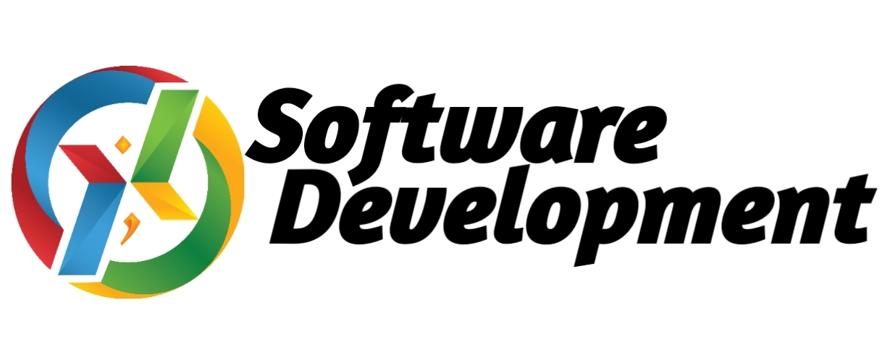

<p align="center"></p>

## About this Project

This project is created for study about Node JS on UKM Software Development.

Credits by Arsyita Devanaya Arianto/3122500008/2 D3 IT A

## Desain Database
<p align="center"></p>

## Depedencies

- [Express JS](https://expressjs.com/en/api.html).
- [Knex](https://knexjs.org/).
- [My SQL](https://www.npmjs.com/package/mysql).
- [DotENV](https://www.npmjs.com/package/dotenv).
- [Express Validator](https://express-validator.github.io/docs).
- [Morgan](https://www.npmjs.com/package/morgan).
- [Nodemon](https://www.npmjs.com/package/nodemon).

# Tutorial Github

## How to Cloning Repository

1. Pada Komputer Anda Buka Console / Command Promt

2. Ketikan Perintah Berikut

```
git clone https://github.com/Arsyitadevanaya/sales-app-node.git
```

3. Masuk Ke Dalam Folder Hasil Clone

```
cd sales-app-node
```

# How to Use and Configuration Node JS Express

1. Install Node Package Manager Terlebih Dahulu <br>
   [Download disini](https://nodejs.org/en/download/)
2. Install all javascript dependecies Terlebih Dahulu

```
$ npm install
```

3. Copy isi file .env.example

```
cp .env.example .env
```

5. Buatlah database kosong di phpmyadmin dengan nama **sales-app**
6. Lakukan Migrasi Database

```
$ knex migrate:latest
```

## How to Run

1. Run server using `npm` command below
```console
$ npm run start
```

## API Documentation

You can access this project API documentation [here](https://documenter.getpostman.com/view/30822425/2sA3BuUncw)